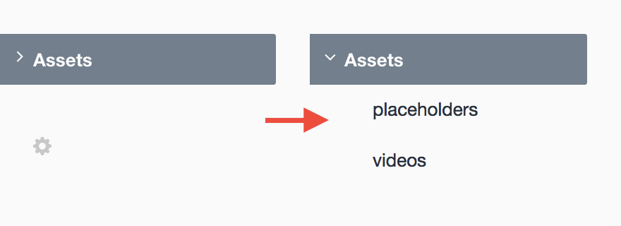

# Disclosed Assets plugin for Craft CMS

Allow your clients to find asset sub-folders by disclosing them by default

## Installation

To install Disclosed Assets, follow these steps:

1. Download & unzip the file and place the `disclosedassets` directory into your `craft/plugins` directory
2.  -OR- do a `git clone https://github.com/nystudio107/disclosedassets.git` directly into your `craft/plugins` folder.  You can then update it with `git pull`
3.  -OR- install with Composer via `composer require nystudio107/disclosedassets`
4. Install plugin in the Craft Control Panel under Settings > Plugins
5. The plugin folder should be named `disclosedassets` for Craft to see it.  GitHub recently started appending `-master` (the branch name) to the name of the folder for zip file downloads.

Disclosed Assets works on Craft 2.4.x, Craft 2.5.x and Craft 2.6.x.

## Disclosed Assets Overview

Disclosed Assets is a simple plugin that just ensures any Assets sub-folders are always disclosed by default. Many times, clients don't see the small `>` disclosure symbol, or have any idea what it does.

After Disclosed Assets is installed, all Assets sub-folders will be disclosed by default:

## Configuring Disclosed Assets

There's nothing to configure.

## Using Disclosed Assets

To use it, just install it, and enjoy happy clients.

Tip: to *create* sub-folders, Control- or right-click on the Asset source name.

## Disclosed Assets Roadmap

Some things to do, and ideas for potential features:

* Release it

Brought to you by [nystudio107](https://nystudio107.com)
